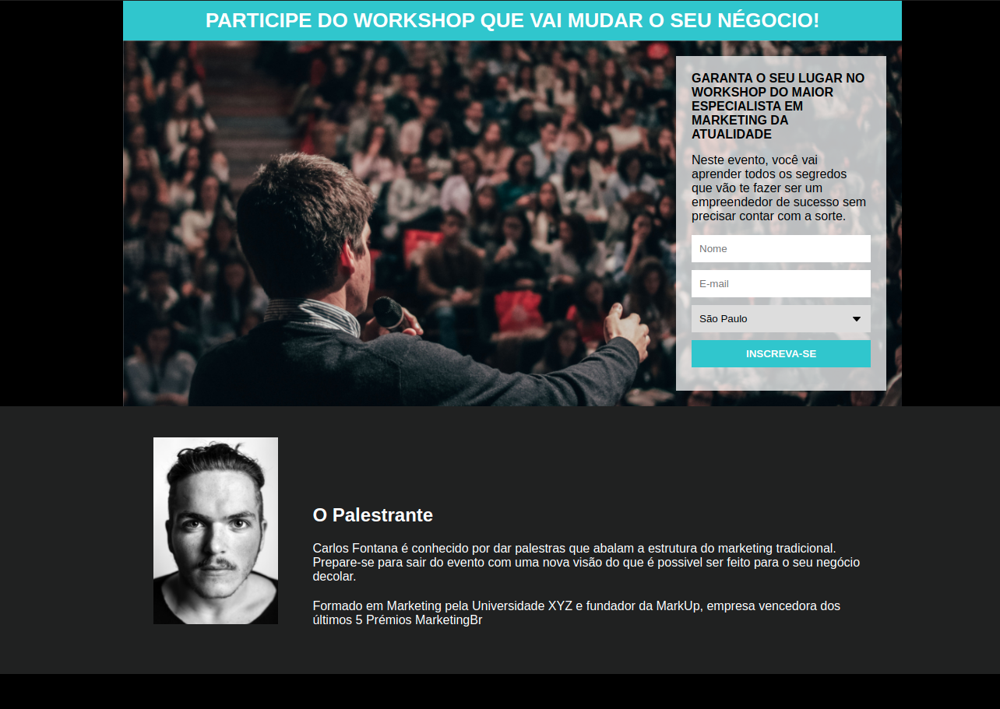

# Pagina de Captura

  

## Sobre o projeto

Projeto criado para praticar conhecimentos e conceitos de HTML e CSS do curso "Desenvolvimento Web Full Stack" do ProgramadorBr.

## 🚀 Tecnologias

Esse projeto foi desenvolvido com as seguintes tecnologias:

- ✔️ HTML

- ✔️ CSS

Made with 💜 by David Bento 👋 [See my linkedin](https://www.linkedin.com/in/david-bento)
